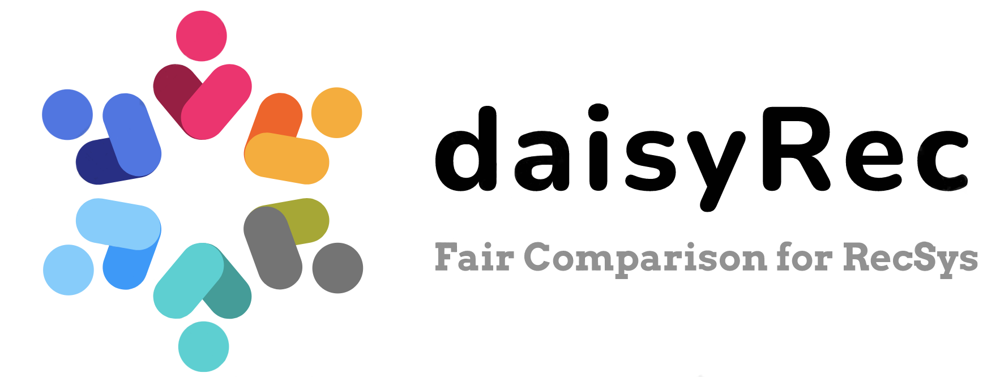

 [](https://github.com/recsys-benchmark/DaisyRec-v2.0)  

## Overview

<!--  -->

DaisyRec-v2.0 is a Python toolkit developed for benchmarking top-N recommendation task. The name DAISY stands for multi-**D**imension f**A**irly compAr**I**son for recommender **SY**stem. The figure below shows the overall framework of DaisyRec-v2.0.

<p align="center">

</p>

To get all dependencies, run:

    pip install -r requirements.txt

Before running, you need first run: 

    python setup.py build_ext --inplace

to generate `.so` or `.pyd` file used for further import.

Make sure you have a **CUDA** enviroment to accelarate since the deep-learning models could be based on it. 

<!---->

## Tutorial - How to use DaisyRec 2.0

Please refer to 'DaisyRec-v2.0-Tutorial.ipynb'. ***Coming soon ...***

## Documentation 

Please refer to [Wiki](https://github.com/recsys-benchmark/DaisyRec-v2.0/wiki) for detailed documentation. ***Coming soon ...***

## Implemented Algorithms

Below are the algorithms implemented in DaisyRec 2.0. More baselines will be added later.

- ***Memory-based Methods***
    - MostPop, ItemKNN
- ***Latent Factor Methods***
    - PureSVD, SLIM, MF, FM
- ***Deep Learning Methods***
    - NeuMF, NFM, NGCF, Multi-VAE

## Datasets

You can download experiment data, and put them into the `data` folder.
All data are available in links below: 

  - [MovieLens 100K](https://grouplens.org/datasets/movielens/100k/)
  - [MovieLens 1M](https://grouplens.org/datasets/movielens/1m/)
  - [MovieLens 10M](https://grouplens.org/datasets/movielens/10m/)
  - [MovieLens 20M](https://grouplens.org/datasets/movielens/20m/)
  - [Netflix Prize Data](https://archive.org/download/nf_prize_dataset.tar)
  - [Last.fm](https://grouplens.org/datasets/hetrec-2011/)
  - [Book Crossing](https://grouplens.org/datasets/book-crossing/)
  - [Epinions](http://www.cse.msu.edu/~tangjili/trust.html)
  - [CiteULike](https://github.com/js05212/citeulike-a)
  - [Amazon-Book/Electronic/Clothing/Music (ratings only)](http://jmcauley.ucsd.edu/data/amazon/links.html)
  - [Yelp Challenge](https://kaggle.com/yelp-dataset/yelp-dataset)

## Ranking Perofmrance for Reference

Please refer to [ranking_results](https://github.com/recsys-benchmark/DaisyRec-v2.0/tree/main/ranking_results) folder for the ranking performance of different baselines across various datasets. ***Updating soon ...***


## TODO List

- [ ] Optimize code for execution effiency
- [ ] Improve the modularity and scalability of the code (e.g., initializer, optimizer)  
- [ ] A more friendly GUI tuner
- [ ] Check Item2vec 

## Cite

Here is a Bibtex entry if you ever need to cite **DaisyRec-v2.0** in a research paper (please keep us posted, we would love to know if DaisyRec-v2.0 is helpful to you)

```
@inproceedings{sun2020are,
  title={Are We Evaluating Rigorously? Benchmarking Recommendation for Reproducible Evaluation and Fair Comparison},
  author={Sun, Zhu and Yu, Di and Fang, Hui and Yang, Jie and Qu, Xinghua and Zhang, Jie and Geng, Cong},
  booktitle={Proceedings of the 14th ACM Conference on Recommender Systems},
  year={2020}
}

```

## Acknowledgements

We refer to the following repositories to improve our code:

 - SLIM and KNN-CF parts with [RecSys2019_DeepLearning_Evaluation](https://github.com/MaurizioFD/RecSys2019_DeepLearning_Evaluation)
 - SVD++ part with [Surprise](https://github.com/NicolasHug/Surprise)
 - NGCF part with [NGCF-PyTorch](https://github.com/huangtinglin/NGCF-PyTorch)
